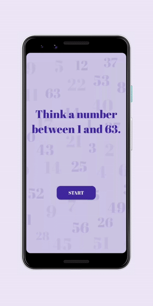

# Cards Trick Game

Build with Flutter

## About

Card trick is a simple number guessing game, game starts with asking user to select a number between 1 and 63(in mind), after that a card is shown to the user with set of some numbers, user needs to answer whether the number he/she has selected is on the card or not and select Yes/No accordingly, same process is done 5 more times, the user is shown a total of 6 cards. And after that user will get a result and it will be the same number user had selected(in mind).

## Screenshots 

  
   

  
  
   

# Try on Android Now - [Download](https://www.mediafire.com/file/0bosz6jz0ll0o35/cards_trick_v1.apk)

[Follow on Twitter](https://twitter.com/shakirkasmani)

## LICENSE
Source code is licensed under [BSD 3-Clause](LICENSE).